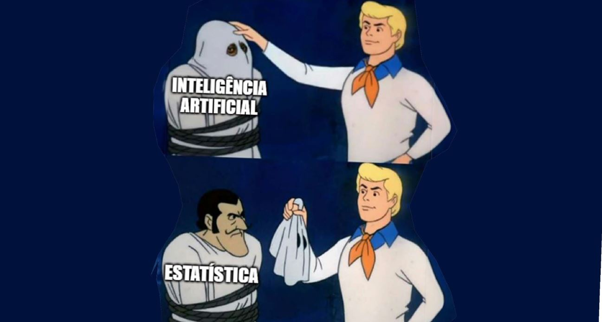

import ReactPlayer from 'react-player'

# Como funciona
Certamente você já teve contato com sistemas de IA que utilizam aprendizado de máquina. Esses sistemas estão por trás de diversas tecnologias do nosso dia a dia, como detectar e-mails de spam, reconhecimento facial, traçar rotas no mapa, sugerir produtos durante compras online, reconhecer e responder à nossa voz, e até mesmo traduzir textos entre várias línguas. O ChatGPT é um excelente exemplo de IA baseada em aprendizado de máquina, impressionando pela sua capacidade de gerar textos e responder perguntas de forma tão natural que você mal percebe que está interagindo com um programa de computador. Essa ferramenta é realmente surpreendente e proporciona uma experiência única de interação.

Fica até difícil pensar como modelos estatísticos são capazes de gerar estes textos.

Vou fazer um experimento usando o meu celular. Você pode experimentá-lo você mesmo para comparar o resultado.

Eu vou fazer o seguinte. Vou digitar aqui no celular as letras E e U. Eu. E depois disso escolher a primeira palavra que ele sugerir no auto completar. Vamos lá!

EU TENHO UM AMIGO QUE TRABALHA NA LOJA.

Vou parar por aqui. O autocompletar do meu celular funciona assim. Ele analisa o que as palavras que digitei até o momento e com base em um dicionário em que ele tem a frequência em que uma palavra ocorre ele sugere as três palavras que segundo o seu cálculo estatístico são as mais prováveis de continuar a frase. Mesmo que você tenha um celular Samsung como o meu, o resultado não vai ser o mesmo. Primeiro porque a versão do dicionário de frequencia pode não ser a mesma e principalmente porque ele observa o que você digita e usa esta informação para atualizar o seu dicionário de frequencia de palavras procurando oferecer palavras que tenham mais a ver com o seu vocabulário e jeito de escrever.

Veja que este trabalho estatístico de escolha das palavras consegue gerar normalmente frases convincentes, como foi no meu caso. E perceba que se eu escolher por alterar uma das palavrsa, por exemplo, depois do EU no lugar do TENHO vou escolher a segunda palavra sugerida "não". Veja que o texto muda, mesmo que eu volte a escolher novamente somente a primeira palavra sugerida.

EU NÃO TENHO O EMAIL DO PROFESSOR.

Claro que o processo de geração dos textos do ChatGPT funcionam de uma forma muito mais elaborada do que a que demonstrei usando o teclado do meu celular, mas a essência do funcionamento é a mesma. Diferente do que uma interação com o ChatGPT pode nos fazer pensar, ele não sabe sabe sobre o que ele está falando. A estratégia é sempre gerar o texto tendo como base o que já foi escrito na conversa e na probabilidade da próxima palavra.

É por isso que, não é incomum, que o ChatGPT gere textos bastante convincentes, mas que não são verdadeiros. Isso já tem até um nome: HALUCINAÇÃO. Isso ocorre quando a ferramenta de IA gera informações incorretas ou inventadas. Isso acontece porque o modelo tenta prever a próxima palavra ou frase com base nos padrões que aprendeu, mas às vezes cria respostas que parecem plausíveis, mas não são verdadeiras.

GRAVAÇÃO PRAÇA ATLETICO. 
--> estou aqui para experimentar o ChatGPT 4o lançado recentemente. Vou fazer isso usando esta estátua que foi inaugurada no dia 10 de maio de 24 ou seja, três dias antes do lançamento do ChatGPT-4o.
 

# IA desmascarada

*Imagem gerada com o Imgflip – Meme generator – Scooby doo mask reveal.*

Hoje, o fundamento principal da maioria dos sistemas de IA é o **aprendizado de máquina**, uma tecnologia que permite que esses sistemas adquiram conhecimento por meio de técnicas estatísticas. Eles analisam e extraem informações de grandes conjuntos de dados para identificar padrões e tomar decisões com base em probabilidades.

Revelação bombástica?

Pode não parecer tão surpreendente à primeira vista, mas essa informação é fundamental para transformar sua percepção e entendimento da IA. Quer um exemplo? 

É o que apresentaremos no próximo capítulo.