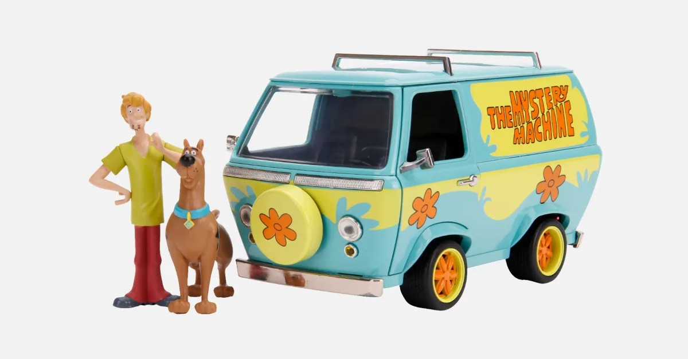

# Desmascarando a IA
Outro dia, deparei-me com um meme sobre IA em minha *timeline*. Ele fazia uma referência ao clássico epílogo dos desenhos do Scooby-Doo, em que o vilão é desmascarado e revelada sua verdadeira identidade. Se você nunca assistiu Scooby-Doo, ao final de cada episódio, a “máscara” do vilão era retirada, revelando um rosto conhecido, um personagem insuspeito que já fazia parte da trama.

*Imagem Brinquedos Jada – Van Mystery Machine Scooby-Doo.*

Se você ainda não viu este meme, vou deixar um toque de suspense antes de revelá-lo. Primeiro, quero destacar o principal objetivo deste capítulo: **"desmascarar" a IA** de forma que você possa entender como ela funciona. Só conseguimos aproveitar ao máximo uma tecnologia quando desvendamos seu princípio de funcionamento. Ao compreendermos como uma tecnologia funciona, seus pontos fortes e fracos, podemos pensá-la de forma estratégica e adaptá-la às nossas necessidades específicas.

*Imagem gerada com o Imgflip – Meme generator – Scooby doo mask reveal.*

Portanto, convido você a embarcar nesta jornada para desmistificar a IA e descobrir como ela pode transformar sua organização. Reavalie suas estratégias atuais e considere integrar a IA de forma mais consciente e eficaz. A tecnologia está aqui para ser explorada; cabe a nós desvendá-la e aproveitá-la ao máximo.