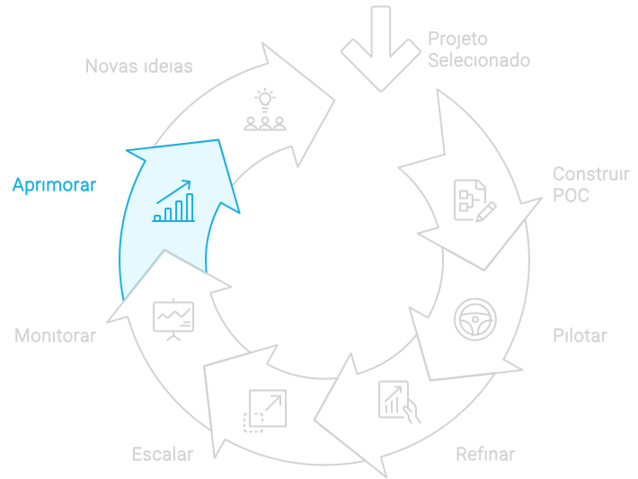

# Aprimorar

A fase de aprimoramento segue naturalmente o **monitoramento**, refinando a solução de IA com base em insights e dados coletados. O objetivo é garantir que a solução permaneça relevante, eficiente e alinhada com os objetivos estratégicos da empresa. Isso envolve ajustar e melhorar continuamente a solução com novos dados, feedback dos usuários e avanços tecnológicos, assegurando que ela continue a gerar valor significativo e sustentável para a organização.

## Implementação da fase Aprimorar
1. **Análise de Feedback e Dados**:
   - **Coleta de Feedback Continuado**: Estabelecer canais contínuos de feedback com usuários finais e stakeholders para identificar áreas de melhoria e novas necessidades.
   - **Análise de Dados Operacionais**: Utilizar análises de dados avançadas para identificar padrões e insights que possam indicar oportunidades de melhoria ou ajustes necessários.

2. **Identificação de Oportunidades de Melhoria**:
   - **Benchmarking Interno e Externo**: Comparar o desempenho da solução de IA com benchmarks internos e externos para identificar áreas onde melhorias podem ser realizadas.
   - **Inovações Tecnológicas**: Acompanhar as últimas inovações e tendências tecnológicas para incorporar novas funcionalidades e melhorias na solução existente.

3. **Desenvolvimento e Implementação de Melhorias**:
   - **Ciclos de Atualização Regulares**: Estabelecer ciclos de atualização regulares para implementar melhorias incrementais na solução de IA, garantindo que ela evolua de forma contínua.

#### Insights Diferenciadores
- **Cultura de Inovação**: Promover uma cultura de inovação contínua dentro da organização, onde a melhoria da solução de IA é vista como um processo contínuo e colaborativo.
- **Engajamento de Stakeholders**: Manter os stakeholders engajados no processo de aprimoramento, garantindo que suas necessidades e expectativas sejam atendidas de forma proativa.
- **Foco em Resultados Tangíveis**: Focar em melhorias que gerem resultados tangíveis e mensuráveis, assegurando que cada atualização contribua para o desempenho e o sucesso da organização.
- **Adaptabilidade e Resiliência**: Garantir que a solução de IA seja adaptável e resiliente, capaz de se ajustar rapidamente às mudanças no ambiente de negócios e às novas demandas do mercado.

## Como continuar
A fase de aprimoramento busca garantir que a solução de IA permaneça relevante, eficaz e alinhada com os objetivos estratégicos da empresa. Com um foco em análise de feedback, identificação de oportunidades de melhoria, desenvolvimento e implementação de melhorias, capacitação contínua e monitoramento de impacto, as organizqções podem assegurar que suas soluções de IA evoluam de forma contínua e sustentável. Este processo não só maximiza o retorno sobre o investimento em IA, mas também fortalece a posição competitiva da organização no mercado, garantindo que a tecnologia continue a gerar valor significativo e duradouro.

A implementação e o monitoramento contínuos geram *insights* que podem inspirar novos projetos. Conforme as soluções de IA são implementadas e usadas, novas necessidades, oportunidades e ideias para otimização ou novos projetos tendem a surgir naturalmente.