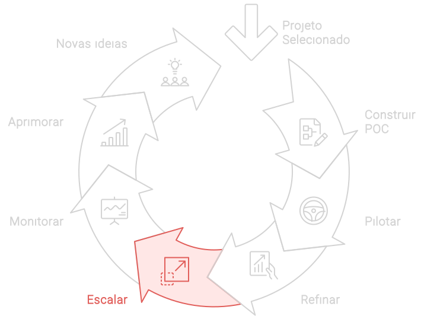

import LigaHighlight from '@site/src/components/gsap/highlight'

# Escalar
<LigaHighlight />

A fase de **Escala** marca o <spam class="text-highlight">ápice de um processo de implementação de IA bem-planejado e executado</spam>. O objetivo é expandir a solução de IA para toda a organização, garantindo que a infraestrutura suporte essa ampliação e que a solução permaneça robusta. Essa etapa visa maximizar o impacto positivo da IA, permitindo à organização colher os benefícios em maior escala e alcançar o ROI planejado.

#### Implementação da fase Escalar

1. **Planejamento Estratégico de Escala**:
   - **Análise de Capacidade**: Avaliar a capacidade da infraestrutura atual para suportar a expansão. Isso inclui recursos de TI, armazenamento de dados e capacidade de processamento.
   - **Mapeamento de Impacto**: Identificar as áreas da organização que serão mais impactadas pela expansão e desenvolver planos específicos para cada uma.

2. **Preparação de Infraestrutura**:
   - **Aprimoramento de Infraestrutura**: Garantir que a infraestrutura de TI esteja preparada para suportar a solução em larga escala. Isso pode incluir upgrades de servidores, redes e sistemas de armazenamento.
   - **Segurança e Compliance**: Reforçar as medidas de segurança e compliance para garantir que a expansão não comprometa a segurança dos dados ou a conformidade regulatória.

3. **Gestão de Mudança e Comunicação**:
   - **Engajamento dos Stakeholders**: Manter uma comunicação clara e contínua com todos os stakeholders para garantir que estejam cientes dos benefícios e das mudanças esperadas com a escalabilidade.
   - **Treinamento e Suporte**: Oferecer treinamentos adicionais e suporte contínuo para garantir que todos os usuários estejam capacitados para utilizar a solução de IA em seu máximo potencial.

4. **Implementação Gradual e Monitoramento**:
   - **Rollout Gradual**: Implementar a solução em fases, começando com unidades de negócio ou departamentos menores antes de expandir para a organização como um todo. Isso permite ajustes rápidos e minimiza riscos.
   - **Monitoramento Contínuo**: Estabelecer mecanismos de monitoramento contínuo para avaliar o desempenho da solução em cada fase da expansão. Utilizar dashboards e relatórios para acompanhar KPIs críticos.

5. **Feedback e Ajustes Contínuos**:
   - **Coleta de Feedback**: Continuar coletando feedback dos usuários finais e stakeholders durante o processo de escalabilidade. Utilizar esses insights para realizar ajustes conforme necessário.
   - **Aprimoramento Contínuo**: Incorporar melhorias contínuas com base nos dados e feedbacks coletados, garantindo que a solução permaneça eficiente e relevante.

## Implementação gradual
A fase de **Escalar** é o ápice de um processo meticuloso de implementação de IA, coroando os esforços com a expansão da solução para toda a organização. No entanto, é importante destacar que essa expansão <spam class="text-highlight">não precisa ocorrer de maneira única e abrangente</spam>. Considerando a diversidade e a complexidade da organização, uma escalabilidade gradual pode ser uma alternativa estratégica para maximizar o impacto da IA de forma sustentável.

Ao invés de uma abrupta mudança em larga escala, a escalabilidade gradual propõe a <spam class="text-highlight">implementação da IA em ciclos estratégicos.</spam> Cada ciclo se concentra em áreas específicas da organização, permitindo um aprofundamento meticuloso das necessidades e desafios de cada setor. A escalabilidade gradual funciona como um ciclo virtuoso de aprendizado. Cada implementação em um novo ciclo oferece valiosos insights que aprimoram a solução de IA como um todo. Essa aprendizagem contínua garante que a solução se torne cada vez mais robusta e eficaz à medida que avança pela organização.

## Insights Diferenciadores
- **Flexibilidade na Implementação**: A escalabilidade deve ser conduzida de forma flexível e adaptável, permitindo ajustes rápidos com base no feedback e no desempenho observado.
- **Alinhamento Estratégico**: Garantir que a expansão da solução de IA esteja alinhada com os objetivos estratégicos da organização, maximizando o impacto positivo e o retorno sobre o investimento.
- **Foco na Experiência do Usuário**: Continuar a melhorar a interface e a usabilidade da solução, garantindo uma alta taxa de adoção e satisfação entre os colaboradores.
- **Cultura de Inovação**: Fomentar uma cultura de inovação contínua, onde a solução de IA seja constantemente refinada e melhorada com base nos insights dos usuários e nas tendências do mercado.

## Como continuar
A etapa de **Escalar** é importante para transformar uma solução de IA bem-sucedida em piloto em uma ferramenta amplamente adotada e eficaz em toda a organização. Com um planejamento estratégico cuidadoso, uma preparação robusta da infraestrutura, uma gestão eficaz de mudanças e um monitoramento contínuo, a sua organização podem garantir uma implementação suave e bem-sucedida. Essa fase finaliza o ciclo inicial de implementação, mas também prepara o terreno para um ciclo contínuo de aprimoramento e inovação, assegurando que a solução de IA continue a fornecer valor significativo e sustentado para a organização.

Após a fase de **Escalar**, o foco se volta para o **Monitoramento** contínuo da solução de IA, assegurando que ela continue a fornecer valor e desempenho conforme esperado.