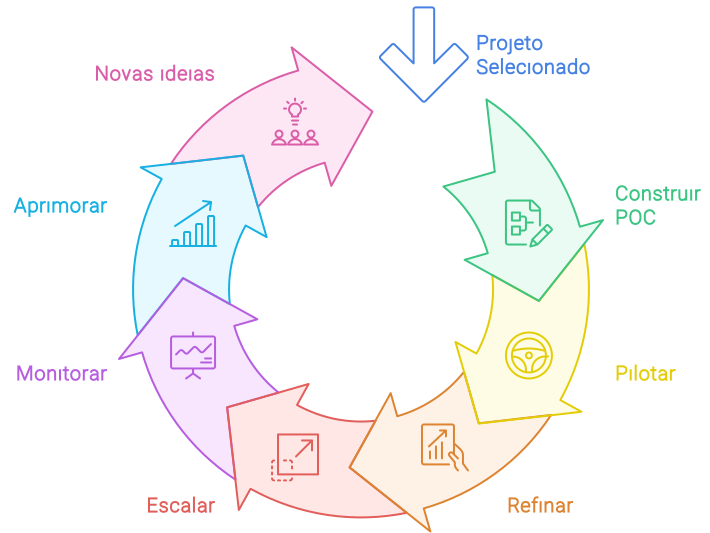

import DocCardList from '@theme/DocCardList';
import LigaHighlight from '@site/src/components/gsap/highlight'

# Implementar
<LigaHighlight />

Neste capítulo, apresento um processo para a <spam class="text-highlight">implementação dos projetos selecionados pela organização</spam>. É importante destacar que um projeto de IA não exige necessariamente programação ou o desenvolvimento de novos sistemas. Muitas vezes, a implementação pode ser realizada utilizando ferramentas de IA disponíveis no mercado. Por exemplo, um projeto pode ser executado por meio da incorporação de uma solução de IA pronta para uso, com o objetivo de otimizar um processo existente na organização.

Proponho o seguinte processo de implementação:
 1. **Prova de Conceito** (POC): Desenvolver uma versão inicial da solução com o essencial para validar sua viabilidade técnica e valor potencial.
 1. **Pilotar**: Implementar a solução e testá-la com alguns usuários em um ambiente real e controlado para avaliar seu desempenho em condições operacionais. Essa etapa ajuda a identificar problemas de usabilidade, desempenho, e adequação ao ambiente operacional real, o que é fundamental antes de uma implementação em larga escala.
 1. **Refinar**: Ajustar a solução com base no *feedback* e nos dados do piloto.
 1. **Escalar**: Expandir a solução para uso mais amplo na organização, assegurando que a infraestrutura suporte a nova escala.
 1. **Monitorar**: Implementar mecanismos de monitoramento contínuo para garantir que a solução funcione conforme o esperado. O monitoramento ajuda a detectar problemas em tempo real, garantir a conformidade com os requisitos de desempenho e segurança, e fornecer dados para futuras melhorias.
 1. **Aprimorar**: Ajustar e melhorar continuamente a solução com base em dados e *feedback*. A evolução contínua garante que a solução permaneça relevante, eficaz e alinhada com as necessidades da organização.
 1. **Novas Ideias**: A implementação e o monitoramento contínuos geram *insights* que podem inspirar novos projetos. Conforme as soluções de IA são implementadas e usadas, novas necessidades, oportunidades e ideias para otimização ou novos projetos tendem a surgir naturalmente.

Utilizei o formato de ciclo contínuo para representar a natureza <spam class="text-highlight">iterativa e evolutiva</spam> do desenvolvimento e implementação de soluções de IA, destacando que o trabalho não se encerra após a implantação inicial. Soluções de IA, como outras tecnologias, exigem um compromisso contínuo: elas precisam ser adaptadas às mudanças no ambiente de negócios, corrigidas conforme surgem problemas, e otimizadas com base em novas informações e feedback. O ciclo se repete até que a solução seja substituída ou descontinuada.

É fundamental que o líder da organização compreenda que <spam class="text-highlight">cada novo projeto de IA implica em custos operacionais recorrentes</spam>. Por isso, tão importante quanto lançar novos projetos é avaliar continuamente as soluções existentes. Somente com monitoramento contínuo é possível <spam class="text-highlight-end">identificar quando uma solução deixa de oferecer benefícios que superem seus custos</spam>, indicando a necessidade de descontinuação. Esse processo contribui para o uso eficiente dos recursos, priorizando projetos e sistemas que realmente agregam valor.
<!-- <DocCardList /> 
Estou na dúvida se coloco os itens do capítulo aqui -->