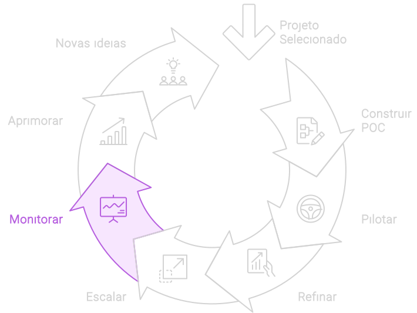

# Monitorar

A fase de monitoramento é essencial para assegurar que, após a **escala** em toda a organização, a solução de IA continue funcionando conforme esperado e gerando valor. O objetivo é manter a operação eficiente da solução, identificando e resolvendo rapidamente eventuais problemas. Essa etapa é crucial para garantir a sustentabilidade e a melhoria contínua, permitindo ajustes proativos e mantendo a alta performance. A evolução contínua da solução assegura que ela permaneça relevante, eficaz e alinhada com as necessidades da organização.

## Implementação da fase de Monitoramento
1. **Indicadores de Desempenho (KPIs)**:
   - Lembre-se de que na etapa de seleção do projeto, foram definidos KPIs que fornecem uma base objetiva para medir o progresso e os resultados. Esses critérios ajudam a verificar se o projeto está gerando os benefícios esperados.

2. **Configuração de Sistemas de Monitoramento**:
   - **Implementação de Dashboards**: Desenvolver dashboards interativos que ofereçam uma visão em tempo real dos KPIs e do desempenho geral da solução de IA. Esses dashboards devem ser acessíveis aos stakeholders relevantes.
   - **Alertas e Notificações**: Configurar alertas e notificações automáticas para informar a equipe de quaisquer desvios significativos dos KPIs estabelecidos, permitindo uma resposta rápida e eficiente.

3. **Coleta e Análise de Dados**:
   - **Monitoramento Contínuo**: Estabelecer processos para a coleta contínua de dados operacionais e de desempenho. Utilizar ferramentas de análise de dados para identificar padrões, tendências e possíveis problemas.
   - **Análise de Causa Raiz**: Quando desvios de desempenho são detectados, realizar análises de causa raiz para identificar as fontes dos problemas e implementar soluções corretivas.

4. **Feedback e Melhoria Contínua**:
   - **Ciclos de Feedback Regulares**: Implementar ciclos regulares de feedback com usuários finais e stakeholders para coletar insights sobre a operação da solução e identificar áreas de melhoria.

5. **Relatórios e Comunicação**:
   - **Relatórios Periódicos**: Produzir relatórios periódicos detalhados sobre o desempenho da solução de IA, destacando os sucessos, desafios e ações tomadas para melhorias.
   - **Comunicação Transparente**: Manter uma comunicação transparente com todos os stakeholders sobre o desempenho da solução e as iniciativas de melhoria, fortalecendo a confiança e o engajamento.

## Insights Diferenciadores
- **Proatividade na Gestão**: A fase de monitoramento permite uma gestão proativa, onde problemas são identificados e resolvidos antes que causem impactos significativos. Isso é crucial para manter a confiança na solução de IA.
- **Transparência e Engajamento**: A comunicação transparente dos resultados de monitoramento e as ações de melhoria aumentam o engajamento dos stakeholders e a aceitação da solução de IA.
- **Cultura de Melhoria Contínua**: Fomentar uma cultura de melhoria contínua garante que a solução de IA evolua constantemente, mantendo-se alinhada com as necessidades do negócio e as tendências tecnológicas.
- **Alinhamento Estratégico**: Monitorar de forma contínua e alinhada aos objetivos estratégicos da empresa garante que a solução de IA contribua de maneira significativa para o sucesso organizacional.

## Como continuar
A fase de monitoramento é vital para garantir o sucesso sustentável da implementação de IA na organização. Focando em indicadores de desempenho, monitoramento contínuo e análise de dados, essa fase assegura que as soluções de IA permaneçam eficazes e alinhadas aos objetivos estratégicos. Além de proteger o investimento em IA, o monitoramento contínuo maximiza o retorno ao permitir ajustes rápidos e sustentados, garantindo que a tecnologia continue a gerar valor significativo e duradouro.

Após a fase de **monitoramento**, a empresa entra na fase de **aprimoramento**, onde a solução de IA é ajustada e melhorada continuamente com base nos dados e insights coletados. Esse ciclo contínuo de monitoramento e aprimoramento assegura que a solução permaneça relevante e eficaz ao longo do tempo.