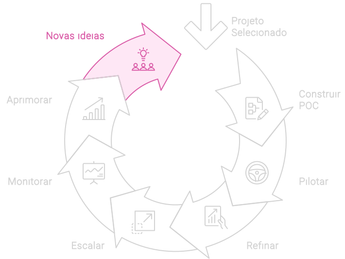

# Novas ideias

A fase de **Novas Ideias** é uma extensão natural das etapas anteriores no ciclo de implementação de IA. Com a implementação e uso contínuo das soluções de IA, surgem novas necessidades e oportunidades, impulsionando a inovação e a expansão das capacidades da IA na organização.

Esta fase promove um ciclo contínuo de descoberta e experimentação, permitindo a implementação de novas funcionalidades e aplicações. O objetivo é fomentar a criatividade, resolver desafios complexos e otimizar processos, além de criar novas oportunidades de negócio.

As novas ideias alimentam esse ciclo e, assim como na fase de ideação, devem ser avaliadas rigorosamente. Se consideradas relevantes, devem ser implementadas de forma estratégica para garantir que a organização se mantenha na vanguarda da transformação digital.

Integrada a um processo contínuo de monitoramento e aprimoramento, a fase de **Novas Ideias** prepara a organização para enfrentar desafios atuais e se adaptar às mudanças do mercado. Isso assegura que a IA não apenas melhore a eficiência, mas também atue como um motor de transformação e crescimento sustentável.

### Como Continuar
Um item bônus não abordado no fluxo inicial deste capítulo é o **Data Lake**. Explicarei o que é e detalharei sua importância na próxima seção.