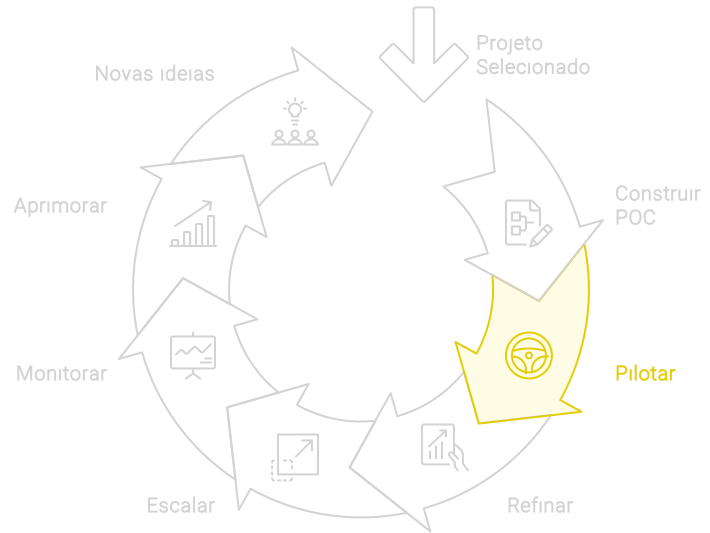

import LigaHighlight from '@site/src/components/gsap/highlight'

# Pilotar
<LigaHighlight />

A fase de Piloto é fundamental para <spam class="text-highlight">testar a solução de IA em um ambiente real, porém controlado</spam>. Seu principal objetivo é validar o desempenho operacional, identificar ajustes necessários e coletar *feedback* dos usuários finais. Funciona como um 'ensaio geral' antes da implementação em larga escala, garantindo que a solução seja robusta, eficaz e bem-aceita. Além disso, o <spam class="text-highlight">Piloto ajuda a identificar</spam> problemas de usabilidade, desempenho e adaptação ao ambiente operacional, o que é essencial para o sucesso da implantação em maior escala.

## Implementação do Piloto

1. **Definição do Escopo**:
   - **Selecionar um Ambiente Controlado**: Escolher um departamento ou uma unidade de negócio onde o impacto e os riscos sejam gerenciáveis. O escopo deve ser suficientemente amplo para fornecer insights relevantes, mas limitado o suficiente para permitir ajustes rápidos e eficientes.

2. **Engajamento dos Stakeholders**:
   - **Envolvimento dos Líderes e Usuários Finais**: Garantir que os líderes empresariais e os usuários finais estejam envolvidos desde o início. Sua colaboração e feedback são essenciais para ajustar a solução conforme necessário.

3. **Execução e Monitoramento**:
   - **Implementação Gradual**: Introduzir a solução de IA de forma gradual, monitorando de perto seu desempenho e impacto. Utilizar métricas claras e específicas para avaliar a eficácia da solução, tais como KPIs de eficiência operacional, satisfação do cliente e ROI preliminar.
   - **Coleta de Dados e Feedback**: Estabelecer canais claros para a coleta de feedback dos usuários finais. Esses insights são valiosos para identificar áreas de melhoria e garantir que a solução atende às necessidades reais do negócio.

4. **Análise e Ajustes**:
   - **Avaliação dos Resultados**: Analisar os dados coletados durante o piloto para avaliar o desempenho da solução. Identificar quaisquer discrepâncias entre os resultados esperados e os resultados reais.
   - **Aperfeiçoamento Contínuo**: Com base nos insights obtidos, realizar ajustes e melhorias na solução. Isso pode incluir refinamento dos algoritmos, ajustes nos modelos de dados ou melhorias na interface do usuário.

## Insights Diferenciadores
- **Iteração Rápida**: Um piloto bem-sucedido depende da capacidade de iterar rapidamente. A coleta e análise de feedback em tempo real permitem ajustes ágeis e melhorias contínuas, garantindo que a solução esteja sempre alinhada com as necessidades do negócio.
- **Cultura de Inovação**: A fase de Piloto é uma oportunidade para fomentar uma cultura de inovação dentro da empresa. Incentivar a participação e o feedback dos colaboradores pode aumentar o engajamento e a aceitação da solução de IA.
- **Gerenciamento de Riscos**: Implementar a solução de IA em um ambiente controlado permite identificar e mitigar riscos antes da escala completa. Isso reduz a probabilidade de falhas e garante uma implementação mais suave e eficaz.

## Como continuar
A fase de Piloto é um passo crítico na jornada de implementação da IA. Ela não só valida a viabilidade operacional da solução, mas também garante que a organização esteja preparada para escalar a solução com confiança. Com uma abordagem estruturada e um foco na coleta de feedback e melhorias contínuas, a fase de Piloto estabelece uma base sólida para o sucesso da IA na organização.

Após a conclusão do piloto, a solução deve ser **Refinada** com base nos feedbacks e na análise dos dados operacionais coletados.