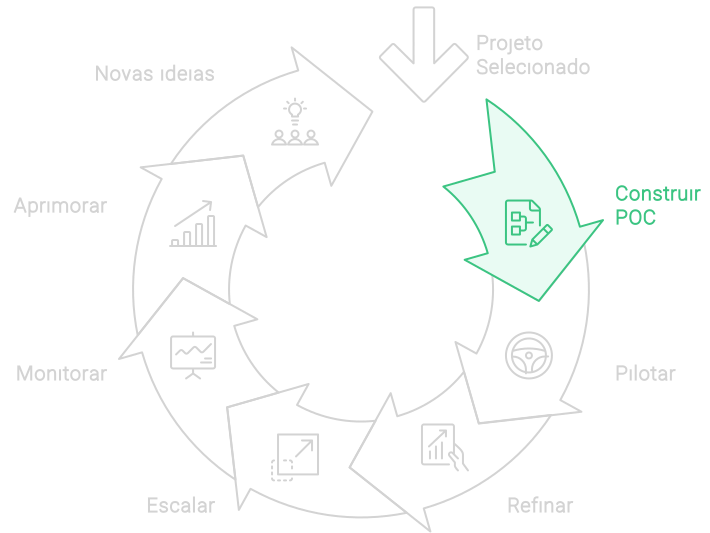

# Prova de conceito (POC)

A implementação de novas ideias na organização deve ser feita com cuidado e estratégia. Mesmo com um planejamento detalhado e medidas de mitigação, estamos lidando com iniciativas inéditas, cujo impacto real pode ser difícil de prever. Cada organização é única, e uma solução bem-sucedida em uma empresa pode não ter o mesmo resultado em outra.

Por isso, é importante adotar uma abordagem estratégica e cuidadosa ao implementar projetos de IA. Isso, porém, não significa que o processo deva ser demorado. Na verdade, a experimentação rápida é fundamental: é necessário testar rapidamente as ideias, descartar as que não funcionam e escalar rapidamente as que demonstram valor.

Para alcançar isso, recomendo que a implementação comece com uma Prova de Conceito (POC). A POC valida a viabilidade das ideias em pequena escala, permitindo analisar seu impacto e eficácia antes de um comprometimento mais amplo. Essa etapa é essencial para assegurar que os projetos de IA entreguem os benefícios esperados, antes de realizar investimentos significativos na implementação completa.

### Por Que Realizar uma POC?

1. **Comprovar a Viabilidade Técnica**: A POC permite testar se a solução técnica proposta é realmente exequível dentro do ambiente específico da sua organização. Isso inclui verificar a disponibilidade e qualidade dos dados necessários, a compatibilidade com os sistemas existentes e a complexidade técnica da implementação.

2. **Avaliar o Valor Potencial**: Uma POC oferece uma visão inicial do valor que o projeto pode trazer. Isso ajuda a confirmar se os benefícios esperados, tanto tangíveis quanto intangíveis, são alcançáveis e se o retorno sobre o investimento (ROI) estimado é realista.

3. **Identificar Riscos e Desafios**: A POC ajuda a identificar possíveis obstáculos e desafios que podem não ter sido identificados durante a fase de planejamento. Isso inclui riscos operacionais, de segurança, privacidade e financeiros. Ao abordar esses desafios antecipadamente, a organização pode desenvolver estratégias eficazes de mitigação.

4. **Facilitar a Tomada de Decisões**: Com base nos resultados da POC, a alta administração pode tomar decisões mais informadas sobre a continuidade do projeto. Se a POC demonstrar que o projeto é viável e valioso, é mais fácil justificar o investimento necessário para a implementação completa.

5. **Promover o Engajamento dos Colaboradores**: Envolver a equipe em uma POC ajuda a promover a aceitação e o engajamento dos colaboradores. Eles podem ver os benefícios práticos da IA em suas funções diárias e oferecer feedback *valioso* para refinamentos antes da implementação em larga escala.

### Como Conduzir uma POC de IA

Para realizar uma POC eficaz, siga estas etapas:

1. **Defina Objetivos Claros**: Estabeleça o que você deseja alcançar com a POC. Isso deve incluir métricas específicas de sucesso que serão usadas para avaliar os resultados.

2. **Selecione um Escopo Reduzido**: Concentre-se em um escopo limitado que possa ser gerenciado e avaliado rapidamente. Escolha um problema específico que seja representativo dos desafios maiores que o projeto visa resolver.

3. **Desenvolva um Plano Detalhado**: Crie um plano de POC que inclua todas as etapas necessárias, os recursos requeridos e um cronograma claro. Certifique-se de que todos os envolvidos entendam suas responsabilidades.

4. **Execute a POC**: Realize a POC de acordo com o plano, monitorando de perto o progresso e coletando dados conforme necessário.

5. **Avalie os Resultados**: Compare os resultados da POC com os objetivos e métricas de sucesso definidos. Analise os dados para determinar se a POC foi bem-sucedida e identifique áreas para melhorias.

### Como continuar
A realização de uma Prova de Conceito (POC) é um passo essencial para o sucesso de projetos de IA. Ela não apenas comprova a viabilidade técnica e o valor potencial, mas também identifica riscos, facilita a tomada de decisões e engaja os colaboradores. Ao integrar a POC à sua estratégia de implementação de IA, sua organização pode minimizar riscos e maximizar benefícios, assegurando que os projetos escolhidos realmente gerem valor e impacto positivo.

Quando a POC é bem-sucedida, o ganho é duplo: ela aumenta a confiança na alocação dos recursos necessários e oferece uma experiência valiosa que torna o desenvolvimento mais assertivo. No entanto, se a POC não atingir os resultados esperados, há a oportunidade de reavaliar ou até mesmo abandonar o projeto antes de comprometer investimentos mais significativos, garantindo uma gestão mais prudente dos recursos da organização.