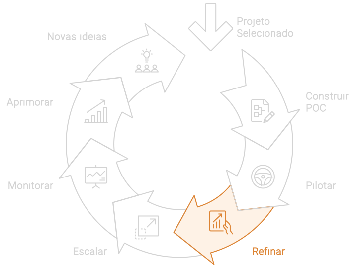

# Refinar

Esta fase busca refinar a solução de IA com base no feedback e nos dados coletados durante o piloto. O objetivo é assegurar que a solução atinja seu potencial máximo de eficiência e eficácia, proporcionando um impacto positivo e sustentável nos negócios.

## Implementação do Refinamento
1. **Análise de Feedback e Dados**:
   - **Coleta Sistemática de Feedback**: Utilizar mecanismos estruturados para coletar feedback dos usuários finais e stakeholders. Isso pode incluir entrevistas, questionários e análises de desempenho.
   - **Análise de Dados Operacionais**: Examinar os dados operacionais coletados durante o piloto para identificar padrões, pontos fortes e áreas que precisam de melhorias. Métricas de desempenho, KPIs específicos e análises qualitativas são essenciais.

2. **Refinamento da Solução**:
   - **Ajuste de Algoritmos e Modelos**: Com base nos insights obtidos, ajustar os algoritmos de IA para melhorar a precisão, a eficiência e a relevância. Isso pode incluir re-treinamento de modelos com novos dados ou ajustes nos parâmetros dos modelos.
   - **Melhoria da Interface do Usuário**: Refinar a interface da solução para garantir que seja intuitiva e fácil de usar, facilitando a adoção pelos usuários finais.
   - **Otimização de Processos**: Identificar e eliminar gargalos operacionais, melhorando a integração da solução de IA com os processos existentes da empresa.
   - **Infraestrutura**: Promover melhorias na infraestrutura da organização de acordo com os gargalos identificados durante o piloto. Lembre-se. A próxima etapa consiste em iniciar o processo de escala da solução para toda a organização.

3. **Capacitação e Requalificação**:
   - **Treinamento Contínuo**: Oferecer treinamentos adicionais para garantir que os colaboradores estejam atualizados sobre as novas funcionalidades e melhorias da solução de IA. A requalificação é crucial para maximizar a eficácia da solução.
   
4. **Implementação de Melhorias**:
   - **Deploy Incremental**: Implementar as melhorias de forma incremental para minimizar riscos e permitir ajustes rápidos conforme necessário. Isso garante uma transição suave e uma implementação mais controlada.
   - **Monitoramento e Avaliação Contínuos**: Estabelecer um sistema de monitoramento contínuo para avaliar o desempenho das melhorias implementadas. Utilizar dashboards e relatórios para acompanhar KPIs críticos e ajustar conforme necessário.

## Insights Diferenciadores
- **Iteração Contínua**: A fase de refinamento enfatiza a importância de um ciclo contínuo de feedback e melhorias. Essa abordagem iterativa permite que a solução de IA se adapte rapidamente às necessidades do negócio e às mudanças no ambiente operacional.
- **Engajamento de Stakeholders**: Manter os stakeholders engajados durante o processo de aperfeiçoamento é vital para que as melhorias estejam alinhadas com as expectativas e necessidades dos usuários finais.
- **Foco na Experiência do Usuário**: Melhorar continuamente a interface do usuário e a usabilidade da solução de IA é essencial para garantir alta taxa de adoção e satisfação dos colaboradores.
- **Cultura de Aprendizado**: Fomentar uma cultura de aprendizado e adaptação contínuos dentro da organização garante que a equipe esteja sempre preparada para tirar o máximo proveito das tecnologias emergentes.

## Como continuar
A etapa de refinamento é vital para transformar uma solução de IA testada em um piloto em uma ferramenta robusta e eficaz. Com uma abordagem sistemática para coleta de feedback, análise de dados e implementação de melhorias, as organizações garantem que suas iniciativas de IA não apenas atendam, mas superem as expectativas, oferecendo valor contínuo. Esse foco no refinamento e na requalificação prepara a organização para um sucesso duradouro na era da IA.

Após a fase de refinamento, espera-se que a solução de IA esteja pronta para ser **escalada**. Nesta etapa, a solução é expandida para outros departamentos e unidades de negócios, mantendo o cuidado para que a infraestrutura suporte o crescimento e que os usuários estejam capacitados para utilizá-la de forma eficaz.