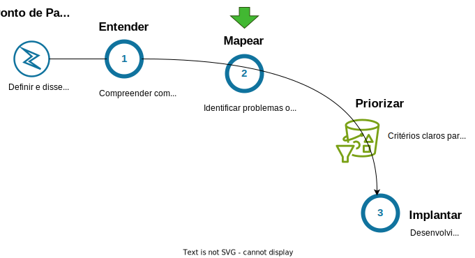

# Grupo de trabalho

O sucesso da implementação da IA na sua organização depende da identificação clara dos problemas específicos ou das oportunidades concretas que deseja resolver ou aproveitar com a IA. Sem essa clareza, corre-se o risco de desperdiçar recursos e não obter os resultados esperados.

 1. **Criar um grupo de pessoas que participarão de um processo de ideação:**
Selecione uma equipe diversificada, composta por membros de diferentes departamentos e níveis hierárquicos. Inclua pessoas com conhecimento técnico em IA, se disponíveis, mas priorize a inclusão de indivíduos que compreendam profundamente os processos de negócios e os desafios enfrentados pela organização. A diversidade de perspectivas é vital para identificar problemas relevantes e explorar oportunidades de forma abrangente.

 1. **Preparar este grupo para o processo**
     1. **Revisar e aprofundar alguns conceitos de IA:**
Ofereça sessões de capacitação para garantir que todos os membros do grupo tenham um entendimento sólido dos conceitos fundamentais de IA, como machine learning, processamento de linguagem natural e IA generativa. Além disso, é essencial que o grupo esteja familiarizado com as políticas de uso da IA na organização e os desafios éticos envolvidos, proporcionando uma visão equilibrada das capacidades e dos riscos associados à tecnologia.
    1. **Imersão do grupo em casos de uso e experimentação de ferramentas de IA:**
Organize workshops ou sessões de imersão em que o grupo possa explorar casos de uso de IA aplicados em diferentes setores e áreas de negócios. Disponibilize acesso a ferramentas de IA para que todos no grupo possam experimentar e entender melhor como a tecnologia funciona na prática.

 1. **Realizar a dinâmica de ideação com o grupo:**
Conduza sessões de ideação estruturadas para estimular a criatividade e a colaboração. Utilize técnicas como brainstorming, design thinking, e mapas mentais para ajudar o grupo a gerar e organizar ideias. Durante estas sessões, incentive os membros a pensar de forma crítica sobre como a IA pode ser aplicada para resolver problemas específicos ou explorar novas oportunidades de negócio. Capture e registre todas as ideias apresentadas pelo grupo.

# Casos de uso
A Inteligência Artificial está revolucionando diversos setores da sociedade. Na próxima sessão, vamos mergulhar em exemplos concretos de como a IA está sendo aplicada de maneiras inovadoras. Primeiramente, destacaremos casos voltados para a melhoria da eficiência e produtividade, o aprimoramento da experiência do cliente e a busca de insights baseados em dados. Em seguida, exploraremos o potencial transformador da IA generativa, mostrando como essa tecnologia emergente está redefinindo limites e criando novas oportunidades.