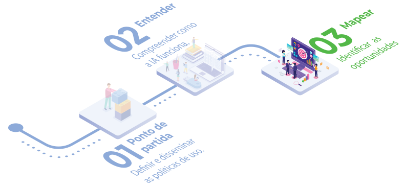
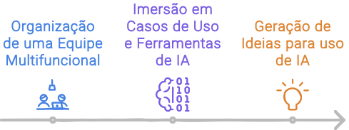

import DocCardList from '@theme/DocCardList'
import LigaHighlight from '@site/src/components/gsap/highlight'

# Mapear
<LigaHighlight />

O sucesso da implementação da IA na sua organização depende da identificação clara dos problemas específicos ou das oportunidades concretas que deseja resolver ou aproveitar com a IA. Sem essa clareza, corre-se o <spam class="text-highlight">risco de desperdiçar recursos</spam> e não obter os resultados esperados.

Neste capítulo vamos abordar <spam class="text-highlight">como identificar</spam> problemas ou oportunidades que sua organização pode abordar com a IA.

Para realizar o mapeamento eu proponho organizá-lo em três etapas.

 - Grupo de Trabalho: <spam class="text-highlight-end">Organziar</spam> uma equipe multifuncional que será responsável discutir as possíveis implementação da IA na organização.
 - Preparação: <spam class="text-highlight-end">Imersão</spam> do grupo em casos de uso e experimentação de ferramentas de IA.
 - Ideação: Identificar onde a IA pode agregar valor, entender os desafios atuais e as oportunidades existentes. <spam class="text-highlight-end">Gerar ideias</spam> sobre como a IA pode ser utilizada para resolver problemas ou criar novas oportunidades.

 Na próxima seção, apresento minhas dicas para organizar e preparar o grupo de trabalho, além de orientar a dinâmica de geração de ideias. 

<!-- <DocCardList /> 
Estou na dúvida se coloco os itens do capítulo aqui -->