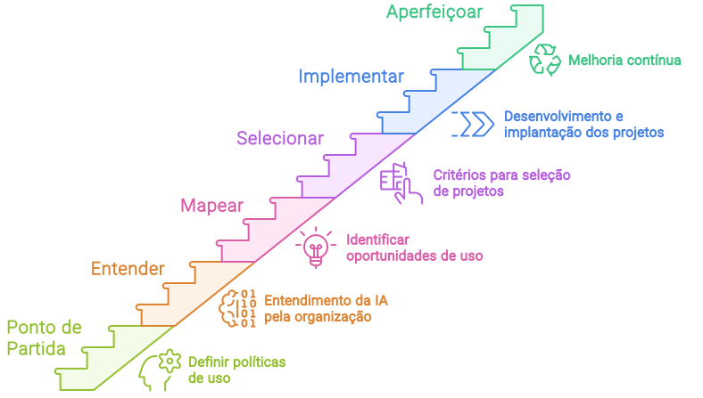

import ChartPwcCEOs from '@site/src/components/charts/PwcCEOsV2'
import PwcCEOsFactors from '@site/src/components/charts/PwcCEOsFactorsV2'
import LigaHighlight from '@site/src/components/gsap/highlight'

# O Desafio
<ChartPwcCEOs />
<LigaHighlight />
Segundo uma pesquisa da PwC, quase metade dos CEOs estão preocupados com a continuidade dos seus negócios. Este cenário é impulsionado por fatores como a rápida mudança no perfil dos clientes, o aumento da concorrência e, principalmente, as transformações tecnológicas.

<PwcCEOsFactors />

As preocupações destacadas pela PwC têm levado executivos a <spam class="text-highlight">acelerar a adoção</spam> de tecnologias emergentes, com a IA generativa no centro das discussões estratégicas das organizações.

A empolgação em torno da IA é evidente. Influenciados por histórias de sucesso e promessas de consultores e fornecedores, os executivos sentem-se compelidos a <spam class="text-highlight">adotar a IA rapidamente</spam>, na expectativa de obter essas vantagens competitivas. 

O desafio nestes momentos de mudança tecnológica é encontrar um <spam class="text-highlight">equilíbrio</spam> entre dois extremos: ignorar a nova tecnologia, correndo o risco de se tornar obsoleto, e investir fortemente nela, correndo o risco de não obter o retorno esperado.

Os autores Thomas H. Davenport e George Westerman abordam esse desafio em um artigo da Harvard Business Review (HBR). Reproduzo um trecho a seguir:

>*Há algo diferente sobre a mudança tecnológica que faz com que executivos seniores de grandes empresas estabelecidas ajam de maneira <spam class="text-highlight">diferente do que normalmente fariam</spam>. Ao investir em uma mudança estratégica típica, os gestores geralmente têm bastante clareza sobre o que desejam realizar e o que será necessário para chegar lá. Dá muito trabalho acertar as coisas, mas eles sabem para onde estão indo e como medir o progresso. Se os indicadores se moverem na direção errada, eles podem tomar medidas para colocá-los no caminho certo ou optar por reduzir o investimento.*
>
>*Com a tecnologia da informação inovadora, no entanto, os executivos às vezes <spam class="text-highlight">perdem suas abordagens de decisão racional</spam>. Certamente, é verdade que em tempos de mudança tecnológica radical, há muito o que descobrir. Os executivos precisam entender o que as novas tecnologias podem fazer e seu impacto nos mercados, produtos/serviços e canais de distribuição. Essas decisões são inevitavelmente influenciadas pelo *hype* dos fornecedores e da mídia, consultores caros oferecendo *insights* de “autoridade no assunto”, muitos experimentos de alto nível e algumas histórias de sucesso empolgantes que fazem as pessoas quererem mais. Um CIO carismático ou CDO pode tornar ainda mais difícil manter a cabeça fria nesses tempos inebriantes.* 
>— *[Why So Many High-Profile Digital Transformations Fail](https://hbr.org/2018/03/why-so-many-high-profile-digital-transformations-fail) - Harvard Business Review*

Como superar o desafio e encontrar o equilíbrio?

Para responder a essa pergunta, podemos nos basear no texto da HBR apresentado acima. O equilíbrio pode ser buscado por meio do <spam class="text-highlight">conhecimento da tecnologia e pela definição de um processo racional de escolha dos projetos</spam>. É essencial que os líderes estejam bem informados sobre as novas tecnologias e entendam seu impacto nos negócios. Além disso, é fundamental estabelecer critérios claros para a seleção de projetos, considerando sua viabilidade, impacto potencial e alinhamento com a estratégia da empresa. Dessa forma, é possível tomar decisões mais informadas e equilibradas, evitando tanto a estagnação quanto o investimento excessivo e mal direcionado.

Por isso quero fazer duas perguntas para você. A primeira:

<FAIcon icon="fa-circle-question" size="1x" /> **Você sabe como a inteligência artificial funciona?**

Escolha abaixo o item que mais se encaixa com a sua resposta.

  
Não sei como a IA funciona.

Os executivos precisam entender o que a IA é capaz de fazer e a partir disso entender seu impacto nos mercados, produtos/serviços e canais de distribuição. O entendimento dos 'bastidores' da IA, hoje dominado por poucos, permitirá que você aproveite ao máximo essa tecnologia inovadora.

Dediquei neste material um capítulo com o propósito de esclarecer o funcionamento da IA.

  
Já sei como a IA funciona.

Muitos acreditam que a Inteligência Artificial é um território exclusivo dos especialistas em TI, mas os executivos que dominam os princípios por trás dessa tecnologia não apenas têm uma vantagem competitiva, mas também a capacidade de desbloquear oportunidades inéditas e moldar o futuro de seus negócios. 

Vamos a segunda pergunta:

<FAIcon icon="fa-circle-question" size="1x" /> **Quais problemas ou oportunidades sua organização pretente abordar com a IA?**

Ou em uma versão mais extensa da pergunta: Quais são os problemas específicos ou as oportunidades concretas sua organização está tentando resolver ou aproveitar com a implementação da IA?

  
Ainda não tenho as oportunidades e problemas mapeados!

O sucesso da implementação da IA na sua organização depende da identificação clara dos problemas específicos ou das oportunidades concretas que deseja resolver ou aproveitar com a IA. Sem essa clareza, corre-se o risco de desperdiçar recursos e não obter os resultados esperados.

Nos próximos capítulos, sugerirei uma estratégia para realizar esse mapeamento, ajudando a identificar áreas críticas e oportunidades promissoras onde a IA pode trazer benefícios significativos.

  
Já tenho mapeado os problemas e as oportunidades!

Ter uma resposta clara para 'Quais problemas ou oportunidades queremos abordar com a IA?' é um passo essencial para o sucesso da implementação da IA na organização. Nos próximos capítulos, sugerirei um processo de priorização e um guia passo a passo para a implementação eficaz da IA, garantindo que você aproveite ao máximo essa tecnologia inovadora e obtenha os resultados desejados.

Nos próximos capítulos vou sugerir um processo de como priorizar e o passo a passo para a sua implantação.  

## Jornada da IA
Neste capítulo, discutimos a importância de <spam class="text-highlight">equilibrar a adoção de novas tecnologias</spam>, evitando tanto a obsolescência quanto os investimentos excessivos e mal direcionados. Destacamos a necessidade de os executivos <spam class="text-highlight">entenderem o funcionamento</spam> da tecnologia e estabelecerem um <spam class="text-highlight">processo</spam> racional para a escolha dos projetos, prevenindo que o entusiasmo ou histórias de sucesso resultem em decisões precipitadas.

O conhecimento técnico e estratégico, aliado a uma abordagem racional, garantirá que os investimentos em novas tecnologias proporcionem retornos significativos e <spam class="text-highlight">sustentáveis</spam>. Nos próximos capítulos, exploraremos detalhadamente como implementar essas estratégias de maneira prática, assegurando que sua organização esteja bem posicionada para aproveitar as oportunidades oferecidas pela IA.

Vamos começar a estruturar o processo de implementação da IA em sua organização. Veja o diagrama com a jornada necessária para a adoção da IA de forma sustentável e responsável:

## Primeiro passo
A jornada de adoção da IA em sua organização deve começar com <spam class="text-highlight-end">uma ação essencial que precede qualquer outra iniciativa relacionada à IA</spam>. Este **ponto de partida** é fundamental e deve ser considerada mesmo que sua organização já tenha iniciado o processo de integração da IA.

