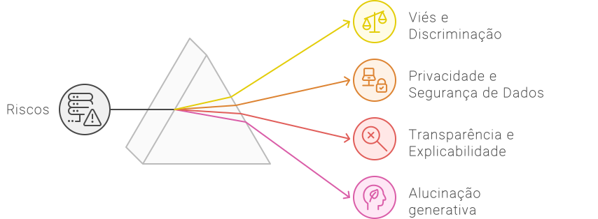

# One Pager
Neste *one pager*, você encontrará um resumo do essencial sobre a IA Generativa.

## O que motivou a atual euforia com a IA?
O surgimento do ChatGPT foi o estopim que desencadeou uma onda de interesse sem precedentes sobre a IA. Este fenômeno foi impulsionado pela rápida adoção do ChatGPT, que alcançou 100 milhões de usuários ativos mensais em apenas 6 semanas, superando marcas como Instagram (2.5 anos), WhatsApp (3.5 anos), YouTube e Facebook (4 anos).

## Isso aconteceu de uma hora para outra?
Esse momento foi preparado por décadas de avanços tecnológicos:
- Lei de Moore (6 décadas): Proporcionou a capacidade computacional necessária para processar enormes quantidades de dados.
- Internet (4 décadas): Forneceu centenas de bilhões de palavras na forma de livros, artigos, sites que puderam ser usados no treinamento do ChatGPT.
- Computação Móvel e em Nuvem (2 décadas): Colocou supercomputadores nas mãos de cada indivíduo.

## Então, o que é IA Generativa?
A IA generativa é uma tecnologia que cria novos conteúdos, como textos, imagens, códigos, vídeos e áudios. Ela é treinada com grandes volumes de dados, aprendendo padrões complexos para gerar conteúdo semelhante, economizando tempo e recursos.

## E os LLMs?
Os sistemas de inteligência artificial geradores de texto, como o ChatGPT, são baseados em modelos de linguagem de grande escala (LLMs – *Large Language Models*). Esses LLMs são treinados em extensos conjuntos de dados para responder a perguntas ou realizar tarefas, utilizando métodos estatísticos para prever a próxima palavra ou a saída mais provável.

Em termos práticos, esses modelos analisam grandes volumes de texto para aprender padrões e contextos linguísticos. Isso permite que eles processem e gerem texto de maneira coerente e relevante.

## Cinco motivos para adotar a IA em minha organização.

## Como as organizações estão incorporando a IA?
- Nível 1 – Individual: Usada de forma independente para tarefas específicas.
- Nível 2 – Processos: Integrada a processos organizacionais para otimizar a eficiência operacional.
- Nível 3 – Geração de Valor: Utilizada estrategicamente para gerar valor tangível.
- Nível 4 – Desenvolvedores de IA: Desenvolvimento de modelos próprios, além de usar ferramentas prontas.
- Nível 5 – Modelo de Negócio: IA como componente central dos produtos ou serviços oferecidos.

## Que tipos de uso as organizações estão fazendo da IA Generativa?

## Para encerrar... Quais são os riscos da IA?

## Vamos lá!
A empolgação em torno da IA generativa está no auge! Mas, com esse entusiasmo vem um risco real: como equilibrar a necessidade de inovação com a prudência nos investimentos? Esse desafio é o tema do próximo capítulo.