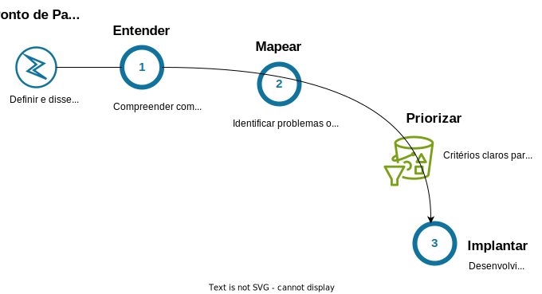

import LigaHighlight from '@site/src/components/gsap/highlight'
import McKinseyNegativeExperience from '@site/src/components/charts/McKinseyNegativeExperience'

# Ponto de partida
<LigaHighlight />
Thierry Garnier, CEO da Kingfisher, descreve como sua empresa se adaptou à GenAI: 
>*No início, <spam class="text-highlight">restringimos todo o acesso ao ChatGPT</spam> e a modelos de linguagem grandes similares, e recebemos muitas reclamações. Mas é preciso confiar nas pessoas e ter princípios claros. Então, trabalhamos em conjunto entre funções, incluindo RH e TI, e <spam class="text-highlight">gradualmente</spam> fornecemos acesso, estabelecemos regras e oferecemos treinamento obrigatório sobre as melhores práticas e perigos - e esses princípios nos permitiram ter um caminho a seguir.*

## IA Generativa: Presença Silenciosa
Uma pesquisa da McKinsey realizada no início deste ano revelou que 90% dos colaboradores das empresas pesquisadas já utilizaram alguma ferramenta de IA generativa, sendo que mais de 43% a utilizam regularmente tanto para fins profissionais quanto pessoais. Isso parece promissor, não? No entanto, uma outra pesquisa realizada pela Oliver Wyman, esta em 2023, divulgada pelo The New York Times, revelou que 39% dos trabalhadores pesquisados utilizaram ferramentas de IA generativa <spam class="text-highlight">sem o conhecimento de suas empresas</spam>. Esses números indicam que a IA generativa já está presente no ambiente de trabalho, muitas vezes sem supervisão ou diretrizes claras. Esse comportamento pode acarretar diversos riscos, incluindo violações de segurança e privacidade, uso inadequado de informações sensíveis e a disseminação de dados imprecisos ou incorretos. Um estudo de 2023 da McKinsey complementa esse quadro de uso da IA generativa ao destacar que <spam class="text-highlight">apenas 21%</spam> das organizações que implementaram IA <spam class="text-highlight">estabeleceram políticas para orientar seu uso</spam>. 

Essa lacuna entre a disponibilidade das ferramentas de IA generativa e a definição de políticas pelas organizações representa um risco significativo. Sem diretrizes claras, os colaboradores podem utilizar a IA de maneiras que comprometem a integridade dos dados e a segurança da empresa.

E a sua organização já tem uma política definida para o uso da IA?

### A Importância de Definir uma Política de Uso e Capacitação em IA
No atual cenário, em que a IA está se tornando cada vez mais predominante, é imperativo que as organizações <spam class="text-highlight">definam políticas claras de uso e ofereçam treinamentos básicos</spam> sobre seu funcionamento e riscos. Mesmo que sua empresa esteja apenas começando a implementar IA, é provável que seus colaboradores já estejam utilizando ferramentas de IA generativa gratuitas, como Gemini e ChatGPT. Isso torna fundamental estabelecer políticas de uso e capacitar os colaboradores adequadamente, independentemente do estágio de adoção da IA na organização. Esse conhecimento é indispensável para que os colaboradores compreendam a lógica subjacente a essas ferramentas, estejam <spam class="text-highlight">cientes dos critérios</spam> de utilização estabelecidos pela organização e entendam a importância de aderirem estritamente a essas diretrizes.

Para reforçar esse ponto, trago mais alguns dados levantados pela McKinsey: 44% das organizações que já adotaram a IA generativa experimentaram pelo menos uma consequência negativa. Entre os riscos mais reportados estão a imprecisão seguida pela segurança cibernética.

<McKinseyNegativeExperience />

### Definindo Políticas de Uso e Capacitação em IA: O Ponto de Partida para o Sucesso
Definir uma política de uso da IA e capacitar adequadamente os colaboradores é uma <spam class="text-highlight">necessidade estratégica</spam>. Com a proliferação de ferramentas de IA generativa no ambiente de trabalho, as empresas devem estabelecer diretrizes claras e programas de capacitação para garantir uma adoção segura, ética e alinhada aos objetivos organizacionais.

Com base nisso, vou incluir um item chamado <spam class="text-highlight">Ponto de Partida</spam> em nosso diagrama do processo de implementação da IA.

## Como a IA funciona?
Com o nosso diagrama de processo atualizado, podemos iniciar a nossa jornada de implantação da IA. <spam class="text-highlight-end">O primeiro passo é entender como a IA funciona</spam>. No próximo capítulo, vamos desvendar os segredos por trás das capacidades revolucionárias da IA. Não perca a chance de acessar um conteúdo exclusivo e obter uma visão privilegiada de como essa ideia simples está moldando o mundo ao nosso redor. Compreender os bastidores da IA, conhecimento atualmente dominado por poucos, permitirá que você aproveite ao máximo essa tecnologia inovadora.