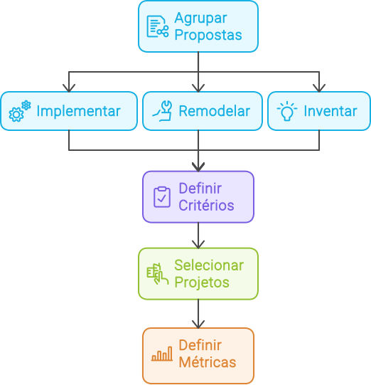

import DocCardList from '@theme/DocCardList';
import LigaHighlight from '@site/src/components/gsap/highlight'

# Selecionar
<LigaHighlight />

A IA tem o potencial de transformar negócios, mas sua <spam class="text-highlight">adoção exige a alocação de recursos da organização</spam>. Estabelecer critérios claros para selecionar e priorizar projetos é fundamental para garantir que esses recursos sejam aplicados nas iniciativas de maior impacto. 

Neste capítulo, destaco a importância de <spam class="text-highlight">estabelecer critérios</spam> para uma implementação eficaz. Proponho agrupar os projetos por tipo de iniciativa e, em seguida, definir os critérios que orientarão o processo de priorização e seleção. Por fim, é fundamental <spam class="text-highlight">definir métricas</spam> para avaliar os resultados obtidos após a implementação de cada projeto selecionado.

<!-- <DocCardList /> 
Estou na dúvida se coloco os itens do capítulo aqui -->